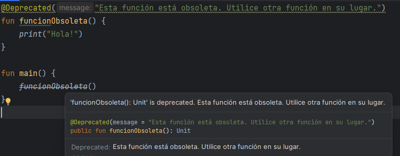

## Anotaciones en Kotlin
Las anotaciones son medios para adjuntar metadatos al código. Para declarar una anotación, ponga el modificador annotation delante de una clase:
``` kotlin
annotation class NombreAnotacion
```
Además, pueden especificarse atributos adicionales anotando la clase de anotación con meta-anotaciones. 

Un ejemplo sencillo para entender cómo funcionan las anotaciones en Kotlin es su uso en la documentación de código. Las anotaciones de documentación son aquellas que se utilizan para proporcionar información adicional sobre el código, como su propósito, uso, autor y más. Estas anotaciones se pueden utilizar para generar documentación automática, como javadoc en Java o dokka en Kotlin.

``` kotlin
/**
 * Esta función imprime un mensaje [n] veces.
 * @param mensaje El mensaje a imprimir.
 * @param n El número de veces que se debe imprimir el mensaje.
 */
fun imprimirMensaje(mensaje: String, n: Int) {
    for (i in 1..n) {
        println(mensaje)
    }
}
```


Otro ejemplo de uso sería, por ejemplo, usar anotaciones en Kotlin para marcar una función como "obsoleta" y proporcionar una advertencia al desarrollador que la utiliza:

``` kotlin
@Deprecated("Esta función está obsoleta. Utilice otra función en su lugar.")
fun funcionObsoleta() {
    print("Hola!")
}

fun main() {
    funcionObsoleta()
}
```
Al utilizar la función `funcionObsoleta()` en el `main()`, el IDE o la consola de depuración mostrará una advertencia que indica que se trata de una función obsoleta y sugiere utilizar otra función en su lugar. Esto ayuda a los desarrolladores a evitar el uso de funciones obsoletas y a mantener el código actualizado con las últimas mejores prácticas y funcionalidades disponibles.




Cabe destacar que Kotlin es un lenguaje interoperable con Java. De este modo, as anotaciones definidas en Kotlin pueden ser utilizadas en código Java de la misma manera que se utilizan las anotaciones definidas en Java. Además, existe el paquete kotlin.jvm que contiene anotaciones y funciones específicas para Java.


En el código de ejemplo, se utilizan anotaciones para validar un formulario. En este caso, las anotaciones `Requerido` y `Rango` se aplican a los campos del objeto Formulario para indicar que son campos obligatorios y que tienen un rango específico de valores permitidos. La anotación `@Target` indica en qué elementos del código se pueden aplicar las anotaciones, en este caso, solo a campos. La anotación `@Retention` indica cuándo se deben retener las anotaciones, en este caso, durante la ejecución del programa.

En el código de ejemplo hay dos formularios creados. En el primero podemos observar que al no ser campo `Requerido` el dni, se ejecuta sin problemas aunque esté vacío. En el segundo, sin embargo, dará error tanto el nombre vacío como la edad (al pasarse del rango).


