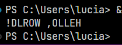

## Aspectos en Python

La librería Aspectlib es una herramienta en Python que permite la programación orientada a aspectos. Proporciona una sintaxis sencilla para definir aspectos, que son funciones o clases que se ejecutan en un punto específico de la ejecución de un programa. Estos puntos de ejecución se llaman puntos de corte (join points) y pueden ser métodos, funciones, llamadas a funciones, excepciones, etc.

Aspectlib utiliza la técnica de tejido (weaving) para combinar los aspectos con el código original. Esto se realiza en tiempo de ejecución, lo que significa que los aspectos no afectan el código original y sólo se ejecutan cuando se cumplen las condiciones establecidas en el punto de corte.

Para crear un aspecto con esta librería, se define una función que realiza una acción específica (por ejemplo, validar una entrada) y se utiliza el decorador `@aspectlib.Aspect` para convertir la función en un aspecto. El aspecto se puede aplicar a cualquier método o función usando la función `aspectlib.weave()`.

Por ejemplo, para aplicar el aspecto `validateInput()` al método `addElement()` de la clase `ListManager`, se puede hacer lo siguiente:

```python

@aspectlib.Aspect
def validateInput(self, element):
    if(isinstance(element, int)):
        yield
        print("Element added to the list.")
    else:
        yield
        print("Invalid input: element must be an integer.")

aspectlib.weave(ListManager.addElement, validateInput)
```


Este código creará un nuevo método que aplicará el aspecto a `addElement()` cada vez que se llame.

Si hablamos sobre las posibilidades del weaving, Aspectlib ofrece una amplia variedad de puntos de corte que se pueden utilizar para aplicar aspectos a diferentes partes del código. Por ejemplo, se pueden utilizar los siguientes puntos de corte:
- Proceed o None - Llama a la función envuelta con los argumentos por defecto. El rendimiento devuelve el valor de retorno de la función o lanza una excepción. Puede usarse varias veces (llamará a la función varias veces).
- Proceed (*args, **kwargs) - Igual que arriba pero con diferentes argumentos.
- Return - Hace que el wrapper devuelva None. Si aspectlib.Proceed no se ha utilizado nunca, no se llamará a la función envuelta. Después de esto el generador se cierra.
- Return (value) - Igual que arriba pero devuelve el valor dado en lugar de None.
- raise exception - Hace que el wrapper lance una excepción.

https://python-aspectlib.readthedocs.io/en/latest/introduction.html#the-aspect

Un ejemplo con Proceed:
```python
import aspectlib

class Calculator:
    def add(self, a, b):
        return a + b

@aspectlib.Aspect
def log_addition(self, a, b):
    print(f"Sumando {a} y {b}")
    result = yield aspectlib.Proceed
    print(f"Resultado: {result}")

aspectlib.weave(Calculator.add, log_addition)

calculator = Calculator()
calculator.add(2, 3)
```
Un ejemplo con Return:
```python
import aspectlib

class StringTransformer:
    def reverse(self, s):
        return s[::-1]

@aspectlib.Aspect
def uppercase_output(self, s):
    result = yield aspectlib.Proceed
    yield aspectlib.Return(result.upper())

aspectlib.weave(StringTransformer.reverse, uppercase_output)

transformer = StringTransformer()
print(transformer.reverse("Hello, world!"))
```
Dado como output:



El código de ejemplo que se encuentra en `aspectos.py` utiliza aspectos para validar el saldo inicial de una cuenta bancaria antes de agregarla a la lista de cuentas del banco. El aspecto `validar_saldo_inicial` se encarga de verificar que el saldo inicial de la cuenta sea mayor o igual a 30 euros. Si el saldo inicial cumple con esta condición, el aspecto permite que la función `agregar_cuenta` continúe su ejecución y agrega la cuenta a la lista del banco. Si el saldo inicial no cumple con la condición, el aspecto interrumpe la ejecución de la función y muestra un mensaje de error.


### Instrucciones de despliegue

Para desplegar y probar el ejemplo, se deben seguir los siguientes pasos:
1. Instalar la librería Aspectlib a través de pip:

```
pip install aspectlib
```

 
2. Descargar el archivo `aspectos.py` que contiene el código de ejemplo. 
3. Ejecutar el archivo con Python:

```
python aspectos.py
```
