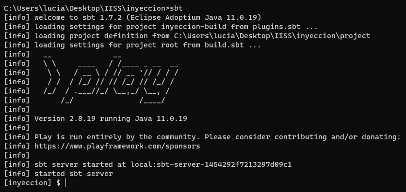
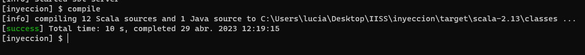
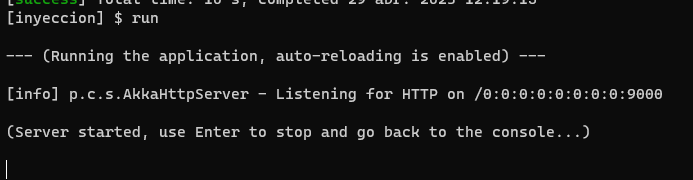
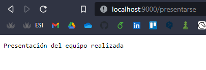
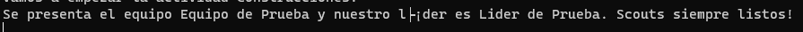
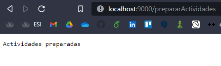
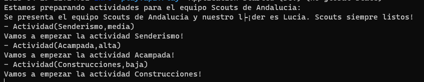
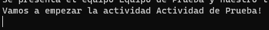

## Inyección en Scala usando el framework Play
Para el funcionamiento de este proyecto, es importante saber que las versiones de Play y Java deben ser compatibles. En mi caso he usado Java 11, Sbt en su versión 1.7.2 y Play en su versión 2.8.19. 
Para compilar el proyecto basta con entrar en la carpeta y escribir el siguiente comando:

```sbt```

Y se nos mostrará algo similar a lo siguiente:



Hecho esto, podemos pasar a compilarlo con `compile`:



Y viendo que no tenemos ningún error, podemos pasar a ejecutarlo con `run`:



Podemos observar que se encuentra escuchando en `localhost:9000`. Se han configurado 3 archivos en la carpeta controllers, los cuales han sido añadidos en el fichero `conf/routes`:

```
GET  /prepararActividades  controllers.CampamentoController.prepararActividades()
GET  /empezar  controllers.ActividadController.empezar()
GET  /presentarse  controllers.EquipoController.presentarse()

```

Por lo tanto, tendremos 3 opciones de rutas disponibles, ligadas a 3 métodos distintos.

- Si accedemos a `localhost:9000/presentarse` obtenemos:





- Si accedemos a `localhost:9000/prepararActividades` obtenemos:





- Si accedemos a `localhost:9000/empezar` obtenemos:



