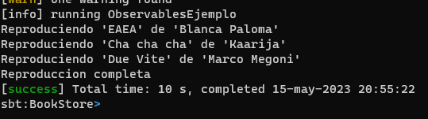

## Observables en Scala. Framework Akka

El código de ejemplo utiliza el framework Akka Streams en Scala para crear un flujo de datos (stream) de canciones y reproducirlas de forma asíncrona.

El objeto `ObservablesEjemplo` contiene la lógica principal del programa. Aquí se define la clase `Cancion` que representa una canción con sus propiedades, como el nombre, el artista y la duración.

El método `reproducirCancion` simula la reproducción asincrónica de una canción. En este caso, simplemente imprime en la consola el nombre y el artista de la canción.

En el método `main`, se configuran los componentes principales del framework Akka Streams: el `ActorSystem` y el `ActorMaterializer`. El `ActorSystem` es la base para la ejecución de actores en Akka y el `ActorMaterializer` es responsable de materializar y ejecutar los flujos de datos.

A continuación, se define una lista de canciones predefinidas. Estas canciones se utilizarán como fuente de datos para el flujo.

El método `reproducirCanciones` crea un flujo de datos (`Source`) a partir de la lista de canciones. Luego, se define un `Sink` llamado `reproducirSink` que utiliza el método `reproducirCancion` como función de procesamiento para cada canción recibida.

Finalmente, se ejecuta el flujo de datos llamando al método `runWith` en el `Source` y pasando el `Sink` como argumento. Esto inicia la reproducción de las canciones.

### Compilación y ejecución
1. Acceder al directorio raíz del proyecto

2. Escribir en la terminal `sbt compile`

3. Escribir en la terminal `sbt run`

El output sería el siguiente:

